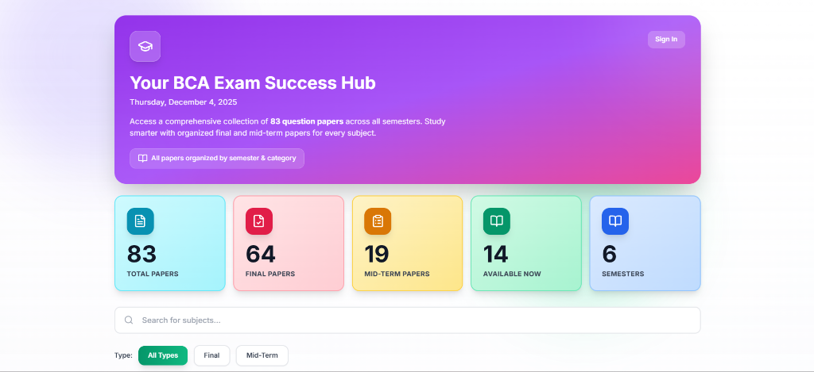

# 📚 BCA Exam Success Hub

<div align="center">



**Your comprehensive collection of BCA question papers - Study smarter, not harder!**

[](https://reactjs.org/)
[](https://www.typescriptlang.org/)
[](https://vitejs.dev/)
[](https://tailwindcss.com/)
[](https://supabase.com/)

[Live Demo](https://your-demo-link.vercel.app) • [Report Bug](https://github.com/AdityaNautiyal908/Exam-Paper/issues) • [Request Feature](https://github.com/AdityaNautiyal908/Exam-Paper/issues)

</div>

---

## 🎯 What is BCA Exam Success Hub?

**BCA Exam Success Hub** is a modern, user-friendly web application designed to help BCA (Bachelor of Computer Applications) students access and organize their exam preparation materials efficiently. The platform provides a comprehensive collection of **83+ question papers** across all semesters, categorized by subject, semester, and paper type (Final/Mid-term).

### 🌟 The Problem It Solves

#### **Before BCA Exam Success Hub:**
- 📂 **Scattered Resources**: Students had to search through multiple sources, WhatsApp groups, and websites to find previous year question papers
- ⏰ **Time-Consuming**: Hours wasted hunting for specific subject papers before exams
- 🔍 **Poor Organization**: Papers were often poorly named, making it difficult to find the right material
- 📱 **No Mobile Access**: Most resources weren't mobile-friendly, limiting study flexibility
- 🎯 **No Categorization**: Papers weren't organized by semester, subject category, or exam type

#### **After BCA Exam Success Hub:**
- ✅ **Centralized Platform**: All question papers in one beautifully designed, easy-to-navigate platform
- ⚡ **Instant Access**: Find any paper in seconds with powerful search and filtering
- 📊 **Smart Organization**: Papers organized by semester (1-6), category (Programming, Core, Database, Web, Advanced), and type (Final/Mid-term)
- 📱 **Mobile-First Design**: Study anywhere, anytime on any device
- 🎨 **Modern UI/UX**: Beautiful, intuitive interface with smooth animations and dark mode support
- 🔐 **Secure & Fast**: Built with Supabase for reliable cloud storage and lightning-fast loading

---

## ✨ Key Features

### 📋 **Comprehensive Paper Collection**
- **83 Total Papers** across all BCA semesters
- **64 Final Papers** for end-semester preparation
- **19 Mid-Term Papers** for continuous assessment
- **6 Semesters** worth of organized content

### 🔍 **Smart Filtering System**
- **Search by Subject**: Quickly find papers for specific subjects
- **Filter by Category**: Programming, Core, Database, Web, Advanced
- **Filter by Semester**: View papers for specific semesters (1-6)
- **Filter by Type**: Toggle between Final and Mid-term papers

### 🎨 **Beautiful User Interface**
- **Modern Design**: Clean, gradient-based UI with glassmorphism effects
- **Smooth Animations**: Framer Motion powered transitions
- **Responsive Layout**: Perfect experience on desktop, tablet, and mobile
- **Dark Theme**: Eye-friendly purple-pink gradient background
- **Interactive Cards**: Hover effects and smooth interactions

### 📄 **Built-in PDF Viewer**
- **In-App Viewing**: View PDFs without leaving the application
- **Download Option**: Save papers for offline access
- **Multiple Papers**: Each subject can have multiple paper variations

### 🔐 **User Authentication** (Clerk Integration)
- **Secure Sign-In**: Protected access with Clerk authentication
- **Admin Panel**: Role-based access for content management
- **User Profiles**: Personalized experience

### ⚡ **Performance Optimized**
- **Fast Loading**: Optimized with Vite for instant page loads
- **Cloud Storage**: Supabase storage for reliable, fast file delivery
- **Lazy Loading**: Efficient resource loading for better performance
- **Caching**: Smart caching strategies for repeat visits

---

## 🛠️ Technology Stack

### **Frontend**
- **React 18.3.1** - Modern UI library with hooks
- **TypeScript 5.7.2** - Type-safe development
- **Vite 6.0.5** - Lightning-fast build tool
- **Tailwind CSS 3.4.17** - Utility-first CSS framework
- **Framer Motion 12.23.24** - Smooth animations
- **React Router DOM 7.9.6** - Client-side routing

### **Backend & Storage**
- **Supabase** - Cloud storage for PDFs and assets
- **Clerk** - User authentication and authorization

### **UI Components & Icons**
- **Lucide React** - Beautiful, consistent icons
- **React Icons** - Additional icon library
- **Canvas Confetti** - Celebration animations
- **SweetAlert2** - Beautiful alert modals

### **Development Tools**
- **PostCSS & Autoprefixer** - CSS processing
- **Node.js Scripts** - Automated paper generation
- **Git** - Version control

---

## 📁 Project Structure

```
BCA-Question-Papers/
├── public/                      # Static assets
│   ├── images/                  # Image files
│   ├── logos/                   # Logo assets
│   └── screenshots/             # App screenshots
├── scripts/                     # Build scripts
│   └── generate-papers.mjs      # Supabase paper sync script
├── src/
│   ├── components/              # React components
│   │   ├── Header.tsx           # App header with auth
│   │   ├── StatsCard.tsx        # Statistics display
│   │   ├── FilterBar.tsx        # Search & filter UI
│   │   ├── SubjectCard.tsx      # Subject paper cards
│   │   ├── PDFViewer.tsx        # PDF viewing modal
│   │   ├── Footer.tsx           # App footer
│   │   ├── AnimatedBackdrop.tsx # Background animations
│   │   └── PageIntro.tsx        # Landing animation
│   ├── data/
│   │   └── subjects.config.json # Subject configuration
│   ├── hooks/
│   │   └── usePapers.ts         # Custom hook for papers
│   ├── types/
│   │   └── index.ts             # TypeScript types
│   ├── utils/
│   │   ├── papers.ts            # Paper utilities
│   │   └── papers.generated.ts  # Auto-generated papers
│   ├── App.tsx                  # Main app component
│   └── main.tsx                 # App entry point
├── .env                         # Environment variables
├── package.json                 # Dependencies
├── tailwind.config.js           # Tailwind configuration
├── tsconfig.json                # TypeScript config
├── vite.config.ts               # Vite configuration
└── vercel.json                  # Vercel deployment config
```

---

## 🚀 Getting Started

### Prerequisites
- **Node.js** (v18 or higher)
- **npm** or **yarn**
- **Supabase Account** (for storage)
- **Clerk Account** (for authentication)

### Installation

1. **Clone the repository**
   ```bash
   git clone https://github.com/AdityaNautiyal908/Exam-Paper.git
   cd Exam-Paper
   ```

2. **Install dependencies**
   ```bash
   npm install
   ```

3. **Set up environment variables**
   
   Create a `.env` file in the root directory:
   ```env
   # Supabase Configuration
   VITE_SUPABASE_URL=your_supabase_url
   VITE_SUPABASE_ANON_KEY=your_supabase_anon_key
   
   # Clerk Authentication
   VITE_CLERK_PUBLISHABLE_KEY=your_clerk_publishable_key
   CLERK_SECRET_KEY=your_clerk_secret_key
   
   # Resend (for admin emails)
   RESEND_API_KEY=your_resend_api_key
   ```

4. **Set up Supabase Storage**
   
   Create a bucket named `papers` in your Supabase project with the following structure:
   ```
   papers/
   ├── final/
   │   ├── sem1/
   │   ├── sem2/
   │   ├── sem3/
   │   ├── sem4/
   │   ├── sem5/
   │   └── sem6/
   └── midterm/
       ├── sem1/
       ├── sem2/
       ├── sem3/
       ├── sem4/
       ├── sem5/
       └── sem6/
   ```

5. **Generate papers from Supabase**
   ```bash
   npm run sync:papers
   ```

6. **Start the development server**
   ```bash
   npm run dev
   ```

7. **Open your browser**
   
   Navigate to `http://localhost:5173`

---

## 📦 Available Scripts

| Command | Description |
|---------|-------------|
| `npm run dev` | Start development server with paper sync |
| `npm run build` | Build for production |
| `npm run preview` | Preview production build |
| `npm run sync:papers` | Sync papers from Supabase storage |

---

## 🎨 Customization

### Adding New Subjects

Edit `src/data/subjects.config.json`:

```json
{
  "id": "your-subject-id",
  "subject": "Subject Name",
  "category": "Programming|Core|Database|Web|Advanced",
  "color": "lavender|mint|sunny|peach",
  "icon": "c|java|python|database|web|cloud|analytics|computer|graphics|security|communication",
  "semesters": [1, 2, 3, 4, 5, 6],
  "matchers": ["subject name variations"]
}
```

### Uploading Papers

1. Upload PDFs to your Supabase `papers` bucket
2. Organize in appropriate folders: `final/sem{1-6}` or `midterm/sem{1-6}`
3. Run `npm run sync:papers` to update the app

---

## 🌐 Deployment

### Deploy to Vercel

1. **Push to GitHub**
   ```bash
   git push origin main
   ```

2. **Import to Vercel**
   - Go to [Vercel](https://vercel.com)
   - Import your GitHub repository
   - Add environment variables
   - Deploy!

3. **Configure Environment Variables**
   
   Add all variables from your `.env` file in Vercel project settings.

---

## 🤝 Contributing

Contributions are welcome! Here's how you can help:

1. **Fork the repository**
2. **Create a feature branch** (`git checkout -b feature/AmazingFeature`)
3. **Commit your changes** (`git commit -m 'Add some AmazingFeature'`)
4. **Push to the branch** (`git push origin feature/AmazingFeature`)
5. **Open a Pull Request**

### Areas for Contribution
- 📄 Adding more question papers
- 🎨 UI/UX improvements
- 🐛 Bug fixes
- 📝 Documentation improvements
- ✨ New features (bookmarks, notes, etc.)

---

## 📊 Statistics

- **Total Papers**: 83+
- **Subjects Covered**: 25+
- **Semesters**: 6
- **Categories**: 5 (Programming, Core, Database, Web, Advanced)
- **Paper Types**: 2 (Final, Mid-term)

---

## 🐛 Known Issues

- None at the moment! 🎉

Found a bug? [Report it here](https://github.com/AdityaNautiyal908/Exam-Paper/issues)

---

## 📝 License

This project is open source and available under the [MIT License](LICENSE).

---

## 👨‍💻 Author

**Aditya Nautiyal**

- GitHub: [@AdityaNautiyal908](https://github.com/AdityaNautiyal908)
- Project Link: [BCA Exam Success Hub](https://github.com/AdityaNautiyal908/Exam-Paper)

---

## 🙏 Acknowledgments

- Thanks to all BCA students who contributed question papers
- Supabase for reliable cloud storage
- Clerk for seamless authentication
- The React and Vite communities for amazing tools

---

## 📸 Screenshots

### Home Page


### Filter & Search
*Powerful filtering by semester, category, and paper type*

### PDF Viewer
*Built-in PDF viewer for seamless paper access*

---

<div align="center">

**Made with ❤️ for BCA Students**

If this project helped you, please give it a ⭐️!

</div>
